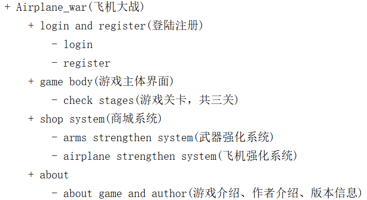

#飞机大战
>编写这个程序主要是为了完成我的Java课程设计，并且锻炼一下自己的编程能力 

## 目录树:

## 绘图和窗口
窗口基本使用swing组件来搭建，而游戏过程中的动画基本是使用Canvas的paint方法来绘制 

## 不足
游戏再编写的时候其实没有先设计好编写的方式，所以中间还穿插了不一样的方法来完成相同的功能，
项目的模块部分也没有组织好，有些地方的代码是重复的。实体类也没有做好设计，出现了冗余和废弃的
情况，编程时遇到的问题解决以后也没有及时的记录下来，这些错误以后应该少犯，做好规划和FAQ。 

